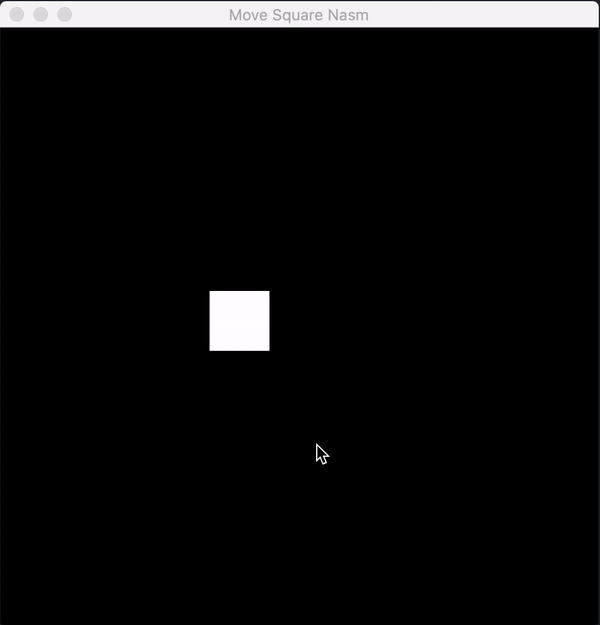

## Moving Square with Raylib and x64 Assembly

A small program that opens a window and lets you move around a white square with the keyboard, and restricts the x and y to the window bounds. It is coded for x64 Mac OS for now, but it would be easy to port to linux as they both use the same C calling convention and only one syscall is used. With this proejct I've also started writing a library called `pal` , "Phill's Assembly Library" with some helpers and abstractions, in addition the raylib wrapper. I used integers for positions and so the movement isn't as smooth as it should be, so next time I'll be trying floats. Also I should probably be making movement framerate independent but for this its fine as it was just a little project for fun

